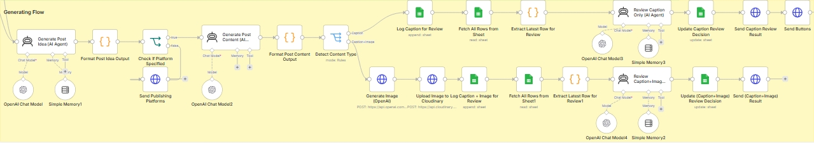
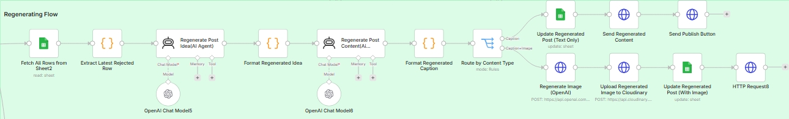
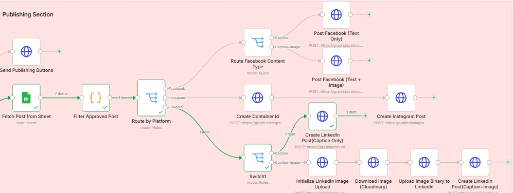
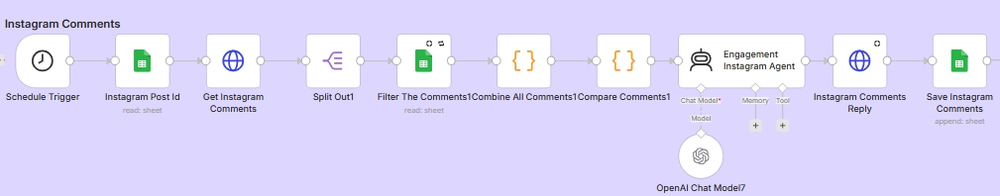
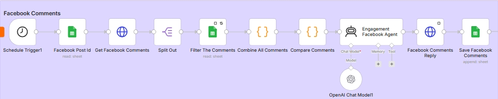

# 🗂️ Social-Media-Assistant-Agent

### AI-Powered Social Media Automation & Engagement System built with n8n

<p align="center">

[](https://n8n.io/)
[](https://openai.com/)
[](https://drive.google.com/)
[](https://cloudinary.com/)
[](https://developers.facebook.com/)
[](https://www.linkedin.com/)
[](https://github.com/omar-n8n/Social-Media-Assistant-Agent)

</p>

<p align="center">
  <b>Generate → Review → Regenerate → Approve → Publish → Engage → Track</b>
</p>

---

## 🚀 System Overview

**Social-Media-Assistant-Agent** is a modular AI-powered automation system that manages the social media content lifecycle from **initial idea to publishing and post-publication engagement**.

Built with **n8n, OpenAI, Cloudinary, Google Drive, Google Sheets, Meta Graph API, and LinkedIn API**, the system transforms a simple **text or voice instruction** into platform-ready content, routes it through human approval, publishes it across supported platforms, and automates relevant comment interactions on Facebook and Instagram.

The system is designed around a clear principle:

> **Automate repetitive social media operations while keeping humans in control of the final publishing decision.**

### End-to-End Pipeline

```text
Idea / Voice Instruction
          ↓
     AI Processing
          ↓
   Content Generation
          ↓
    Media Processing
          ↓
    Human Approval
       ↙       ↘
 Regenerate    Approve
       ↓          ↓
    AI Loop    Publish
                  ↓
              Engage
                  ↓
               Track
```

---

# 📸 Workflow Screenshots

## ⚙️ Content Generation



---

## 🔄 Content Regeneration



---

## 🚀 Multi-Platform Publishing



---

## 💬 Instagram Comment Automation



---

## 💬 Facebook Comment Automation



---

# ✨ What the System Does

The platform combines **content intelligence, content generation, media management, human approval, publishing, engagement automation, and tracking** into a single modular workflow.

### Content Creation

* Accept text or voice instructions
* Convert voice to text with OpenAI Whisper
* Understand the user's content requirements
* Generate platform-ready captions
* Generate AI images when requested
* Support multiple content formats
* Regenerate content when the user requests another version

### Publishing

* Publish approved content to Facebook
* Publish approved content to Instagram
* Publish approved content to LinkedIn
* Handle platform-specific publishing requirements
* Track publishing information

### Engagement

* Retrieve supported Facebook and Instagram comments
* Filter comments before automated processing
* Check whether a comment has already been handled
* Generate AI-powered responses
* Publish automated replies
* Prevent duplicate responses
* Track comment processing

---

# 🧠 Core Capabilities

| Capability                       | Description                                                          |
| -------------------------------- | -------------------------------------------------------------------- |
| 🎙️ **Voice Input**              | Convert voice instructions into text using OpenAI Whisper            |
| 💬 **Text Input**                | Accept direct content instructions                                   |
| 🧠 **AI Content Intelligence**   | Interpret requests and determine the required content workflow       |
| ✍️ **AI Copywriting**            | Generate platform-ready social media content                         |
| 🖼️ **AI Image Generation**      | Create visual assets when requested                                  |
| 🔄 **Content Regeneration**      | Generate alternative versions through an approval loop               |
| ☁️ **Media Management**          | Upload and manage generated media through Cloudinary                 |
| 👤 **Human Approval**            | Keep the user in control before publishing                           |
| 🌐 **Multi-Platform Publishing** | Publish across Facebook, Instagram, and LinkedIn                     |
| 💬 **Comment Automation**        | Process and respond to supported Facebook and Instagram comments     |
| 🧹 **Comment Filtering**         | Filter comments before automated handling                            |
| 🛡️ **Duplicate Prevention**     | Prevent previously handled comments from receiving duplicate replies |
| 📊 **Content Tracking**          | Track content and processing state using Google Sheets               |
| ⚙️ **Workflow Orchestration**    | Coordinate the complete automation through n8n                       |

---

# 🏗️ Architecture

The system is structured as a modular automation pipeline where each layer has a clearly defined responsibility.

```text
┌──────────────────────────────┐
│        Input Layer           │
│      Text / Voice Input      │
└──────────────┬───────────────┘
               ↓
┌──────────────────────────────┐
│      Intelligence Layer      │
│    OpenAI / Request Logic    │
└──────────────┬───────────────┘
               ↓
┌──────────────────────────────┐
│     Content Generation       │
│   Caption + Optional Image   │
└──────────────┬───────────────┘
               ↓
┌──────────────────────────────┐
│       Media Layer             │
│          Cloudinary           │
└──────────────┬───────────────┘
               ↓
┌──────────────────────────────┐
│      Approval Layer           │
│     Human-in-the-Loop         │
└──────────────┬───────────────┘
               ↓
┌──────────────────────────────┐
│      Publishing Layer         │
│ Facebook / Instagram / LinkedIn│
└──────────────┬───────────────┘
               ↓
┌──────────────────────────────┐
│      Engagement Layer         │
│ Comment Retrieval / Filtering │
│ AI Replies / Duplicate Check  │
└──────────────┬───────────────┘
               ↓
┌──────────────────────────────┐
│       Tracking Layer          │
│        Google Sheets          │
└──────────────────────────────┘
```

---

# 🧩 Architecture Layers

| Layer                  | Technology     | Responsibility                             |
| ---------------------- | -------------- | ------------------------------------------ |
| **Input**              | Meta Messenger | Receive text and voice requests            |
| **Speech-to-Text**     | OpenAI Whisper | Convert voice instructions into text       |
| **AI Intelligence**    | OpenAI         | Understand requests and generate content   |
| **Content Generation** | OpenAI         | Generate captions and content variations   |
| **Image Generation**   | OpenAI Images  | Create visual assets                       |
| **Media Management**   | Cloudinary     | Host and manage generated media            |
| **File Storage**       | Google Drive   | Store workflow assets                      |
| **Approval**           | n8n            | Control the human review process           |
| **Publishing**         | Meta Graph API | Facebook & Instagram publishing            |
| **Publishing**         | LinkedIn API   | LinkedIn publishing                        |
| **Engagement**         | Meta Graph API | Retrieve and respond to supported comments |
| **Tracking**           | Google Sheets  | Store content and processing state         |
| **Orchestration**      | n8n            | Connect and coordinate the complete system |

---

# ✍️ Content Generation

The content engine supports two primary generation modes.

| Content Type        | Caption | Image |
| ------------------- | :-----: | :---: |
| **Caption Only**    |    ✅    |   ❌   |
| **Caption + Image** |    ✅    |   ✅   |

The workflow determines the required content format based on the user's request.

This avoids unnecessary generation steps and keeps the automation flexible for different publishing scenarios.

---

# 🧠 AI Content Intelligence

The system separates **request understanding** from the actual content-generation process.

This allows the workflow to interpret:

* Content ideas
* Desired format
* Platform requirements
* Tone and style
* Image requirements
* User instructions

The result is a structured content-generation pipeline rather than a single AI prompt producing an unstructured response.

---

# 🖼️ AI Media Pipeline

When visual content is requested, the system generates the image and passes it through the media-management layer before publishing.

```text
Content Request
      ↓
AI Content Generation
      ↓
AI Image Generation
      ↓
Cloudinary Upload
      ↓
Hosted Media URL
      ↓
Publishing Layer
```

### Why Cloudinary?

Using a dedicated media layer separates **asset hosting** from the automation workflow itself.

This makes generated media easier to:

* Host
* Reuse
* Deliver
* Pass between workflow steps
* Integrate with external publishing APIs

---

# 👤 Human-in-the-Loop Approval

Automation handles the repetitive work, but the user retains control over the final content.

```text
              AI Generates
                   ↓
              Human Review
              ↙         ↘
        Regenerate      Approve
             ↓             ↓
        New Version     Publish
             │             │
             └──────┬──────┘
                    ↓
                Continue
```

### Approval Actions

| Action            | Workflow Behavior              |
| ----------------- | ------------------------------ |
| ✅ **Approve**     | Continue to publishing         |
| 🔄 **Regenerate** | Generate a new content version |
| ❌ **Stop**        | End the current workflow       |

This creates a controlled automation model where AI accelerates execution without removing human oversight.

---

# 🌐 Multi-Platform Publishing

Approved content can be routed to multiple publishing destinations.

### Supported Platforms

| Platform  | Publishing |
| --------- | :--------: |
| Facebook  |  🟢 Active |
| Instagram |  🟢 Active |
| LinkedIn  |  🟢 Active |

The publishing layer is kept separate from content generation, allowing platform-specific integrations to evolve independently.

---

# 💬 Automated Comment Engagement

The system extends beyond publishing by introducing a dedicated **post-publication engagement layer**.

For supported Facebook and Instagram posts, the workflow can retrieve comments and process them through an automated response pipeline.

### Comment Processing Pipeline

```text
Published Post
      ↓
Retrieve Comments
      ↓
Filter Comments
      ↓
Check Processing History
      ↓
Generate AI Response
      ↓
Publish Reply
      ↓
Log Processing State
```

The workflow does not blindly reply to every retrieved comment.

Comments pass through filtering and processing checks before an automated response is published.

---

# 🧹 Comment Filtering

The engagement workflow includes a filtering stage before generating replies.

This allows the automation to distinguish between comments that should be processed and comments that should be skipped according to the workflow's configured logic.

```text
Incoming Comment
       ↓
   Filter Logic
    ↙       ↘
  Skip     Process
             ↓
        AI Response
```

This adds an additional control layer between comment retrieval and automated response generation.

---

# 🛡️ Duplicate Reply Prevention

The system maintains processing state to avoid repeatedly responding to the same comment.

```text
New Comment
     ↓
Check Processing History
     ↙             ↘
Already Handled    New Comment
     ↓                 ↓
   Skip            Process
                       ↓
                 Generate Reply
                       ↓
                   Send Reply
                       ↓
                 Save State
```

This prevents the workflow from unnecessarily generating or publishing duplicate responses for comments that have already been handled.

---

# 📊 Tracking & State Management

**Google Sheets** acts as a lightweight tracking layer across the automation.

Depending on the workflow stage, it can store information such as:

* Content details
* Platform
* Publishing status
* Post identifiers
* Processing state
* Comment identifiers
* Comment handling status
* Generated responses

This provides a persistent state layer without requiring a separate database infrastructure.

---

# 🔄 Complete Workflow

```text
┌───────────────────────┐
│   Text / Voice Input  │
└───────────┬───────────┘
            ↓
┌───────────────────────┐
│   Speech-to-Text       │
│     if required        │
└───────────┬───────────┘
            ↓
┌───────────────────────┐
│    AI Intelligence     │
│       OpenAI           │
└───────────┬───────────┘
            ↓
      ┌─────┴─────┐
      ↓           ↓
 Caption Only   Caption + Image
      │           │
      │      ┌────▼────┐
      │      │ AI Image│
      │      └────┬────┘
      │           ↓
      │      ┌──────────┐
      │      │Cloudinary│
      │      └────┬─────┘
      │           │
      └─────┬─────┘
            ↓
      Human Review
        ↙       ↘
   Regenerate   Approve
        ↓          ↓
      AI Loop   Publishing
                   ↓
        ┌──────────┼──────────┐
        ↓          ↓          ↓
     Facebook   Instagram  LinkedIn
        │          │
        └─────┬────┘
              ↓
       Comment Retrieval
              ↓
       Comment Filtering
              ↓
      Duplicate Check
              ↓
         AI Response
              ↓
         Publish Reply
              ↓
           Tracking
```

---

# 📈 Content Lifecycle

| Stage                 | System Action                                |
| --------------------- | -------------------------------------------- |
| 1️⃣ **Input**         | Receive text or voice instruction            |
| 2️⃣ **Understand**    | Interpret the request with AI                |
| 3️⃣ **Generate**      | Create caption and optional image            |
| 4️⃣ **Process Media** | Upload generated assets                      |
| 5️⃣ **Review**        | Present content for human approval           |
| 6️⃣ **Regenerate**    | Create a new version if requested            |
| 7️⃣ **Approve**       | Confirm final content                        |
| 8️⃣ **Publish**       | Publish to selected platforms                |
| 9️⃣ **Retrieve**      | Fetch supported post comments                |
| 🔟 **Filter**         | Determine which comments should be processed |
| 1️⃣1️⃣ **Respond**    | Generate and publish AI-powered replies      |
| 1️⃣2️⃣ **Track**      | Store publishing and engagement state        |

---

# 🔗 Integrations

| Service            | Role                                           | Status |
| ------------------ | ---------------------------------------------- | :----: |
| **n8n**            | Workflow orchestration                         |   🟢   |
| **OpenAI**         | AI processing, Whisper & image generation      |   🟢   |
| **Cloudinary**     | Media hosting & management                     |   🟢   |
| **Google Drive**   | File & asset storage                           |   🟢   |
| **Google Sheets**  | Content & processing state                     |   🟢   |
| **Meta Graph API** | Facebook & Instagram publishing and engagement |   🟢   |
| **LinkedIn API**   | LinkedIn publishing                            |   🟢   |

---

# 💼 Practical Use Cases

| Use Case                      | Application                                                     |
| ----------------------------- | --------------------------------------------------------------- |
| 🏢 **Business Content**       | Generate and publish consistent branded content                 |
| 📣 **Marketing Teams**        | Automate repetitive content operations                          |
| 👤 **Personal Brands**        | Maintain a structured publishing workflow                       |
| 🚀 **Startups**               | Reduce manual content production and publishing work            |
| 📱 **Social Media Managers**  | Manage generation, approval, publishing, and engagement         |
| 💬 **Community Management**   | Automate relevant comment responses                             |
| 🤖 **AI Automation Services** | Extend the architecture into client-specific automation systems |

---

# 📁 Repository Structure

```text
Social-Media-Assistant-Agent
│
├── README.md
│
├── workflow
│   └── Social-Media-Assistant-Agent.json
│
├── Screenshots
│   ├── Generating-Flow.jpeg
│   ├── Regenerating-Flow.jpeg
│   ├── Publishing-Flow.jpeg
│   ├── Instagram-Comments-Reply.jpeg
│   └── Facebook-Comments-Reply.jpeg
│
└── assets
```

---

# ⚙️ Installation

### 1. Clone the Repository

```bash
git clone https://github.com/omar-n8n/Social-Media-Assistant-Agent.git
```

### 2. Import the Workflow

Open n8n and import:

```text
workflow/Social-Media-Assistant-Agent.json
```

### 3. Configure Credentials

Connect the required services:

* OpenAI
* Cloudinary
* Google Drive
* Google Sheets
* Meta
* LinkedIn

### 4. Configure Platform Settings

Update the workflow with your own:

* API credentials
* Page and account identifiers
* Spreadsheet configuration
* Platform-specific settings
* Required API permissions

### 5. Activate

Once the required credentials and configuration are in place, activate the workflow and begin sending content requests.

---

# 🔐 Requirements

| Requirement                  | Purpose                                                |
| ---------------------------- | ------------------------------------------------------ |
| **n8n**                      | Workflow automation and orchestration                  |
| **OpenAI API**               | AI processing, speech-to-text and content generation   |
| **Cloudinary Account**       | Media hosting and delivery                             |
| **Google Drive**             | File and asset storage                                 |
| **Google Sheets**            | Content and processing state                           |
| **Meta Developer Setup**     | Facebook & Instagram publishing and comment automation |
| **LinkedIn Developer Setup** | LinkedIn publishing                                    |

---

# 🗺️ Roadmap

## Content Creation

| Feature                | Status      |
| ---------------------- | ----------- |
| Speech-to-Text         | ✅ Completed |
| AI Copywriting         | ✅ Completed |
| Flexible Content Types | ✅ Completed |
| AI Image Generation    | ✅ Completed |
| AI Video Generation    | 🔜 Planned  |

## Publishing

| Feature                            | Status      |
| ---------------------------------- | ----------- |
| Facebook Publishing                | ✅ Completed |
| Instagram Publishing               | ✅ Completed |
| LinkedIn Publishing                | ✅ Completed |
| Scheduled Posts                    | 🔜 Planned  |
| Advanced Multi-Platform Publishing | 🔜 Planned  |

## Engagement

| Feature                      | Status      |
| ---------------------------- | ----------- |
| Facebook Comment Automation  | ✅ Completed |
| Instagram Comment Automation | ✅ Completed |
| Comment Filtering            | ✅ Completed |
| Duplicate Reply Prevention   | ✅ Completed |
| AI Engagement Assistant      | 🔜 Planned  |
| Comment Sentiment Analysis   | 🔜 Planned  |

## Analytics

| Feature                   | Status     |
| ------------------------- | ---------- |
| Analytics Dashboard       | 🔜 Planned |
| Post Performance Tracking | 🔜 Planned |
| AI Performance Insights   | 🔜 Planned |

---

# 🧰 Tech Stack

| Technology         | Role                                         |
| ------------------ | -------------------------------------------- |
| **n8n**            | Workflow automation & orchestration          |
| **OpenAI**         | AI reasoning, Whisper & image generation     |
| **Cloudinary**     | Media hosting & management                   |
| **Google Drive**   | Asset storage                                |
| **Google Sheets**  | Content & processing state                   |
| **Meta Graph API** | Facebook & Instagram publishing & engagement |
| **LinkedIn API**   | LinkedIn publishing                          |

---

# 🧩 Design Philosophy

The system follows a **modular, human-controlled automation architecture**.

Each major responsibility is isolated into a logical layer:

```text
Input
  ↓
Intelligence
  ↓
Generation
  ↓
Media
  ↓
Approval
  ↓
Publishing
  ↓
Engagement
  ↓
Tracking
```

This structure makes the system easier to:

* Maintain
* Debug
* Extend
* Reuse
* Customize
* Integrate with additional platforms
* Introduce new AI capabilities

The architecture is intentionally designed as a **reusable foundation for production-oriented social media automation**, rather than a single-purpose workflow.

---

# ⭐ Project Highlights

| Capability                 | Implementation       |
| -------------------------- | -------------------- |
| AI Content Intelligence    | OpenAI               |
| Voice-to-Text              | OpenAI Whisper       |
| AI Visual Creation         | OpenAI Images        |
| Media Infrastructure       | Cloudinary           |
| Human Approval Loop        | n8n                  |
| Content Regeneration       | n8n + OpenAI         |
| Multi-Platform Publishing  | Meta + LinkedIn      |
| Comment Automation         | Meta Graph API + n8n |
| Comment Filtering          | n8n                  |
| Duplicate Reply Prevention | n8n + Google Sheets  |
| Content Tracking           | Google Sheets        |
| Asset Management           | Google Drive         |
| Automation Engine          | n8n                  |

---

# 📄 License

This project is provided for **portfolio and educational purposes**.

---

# 👨‍💻 Author

## Omar Ali Osman

**AI Automation Developer**

Focused on building practical automation systems using:

* AI Automation
* n8n Workflow Development
* AI Agents
* API Integrations
* RAG Systems
* Social Media Automation

**GitHub:**
https://github.com/omar-n8n

**LinkedIn:**
https://www.linkedin.com/in/omar-ali-007000379/

---

<p align="center">

### ⭐ If you found this project useful, consider giving it a Star!

**Built with ❤️ using n8n, OpenAI & Cloudinary**

</p>
